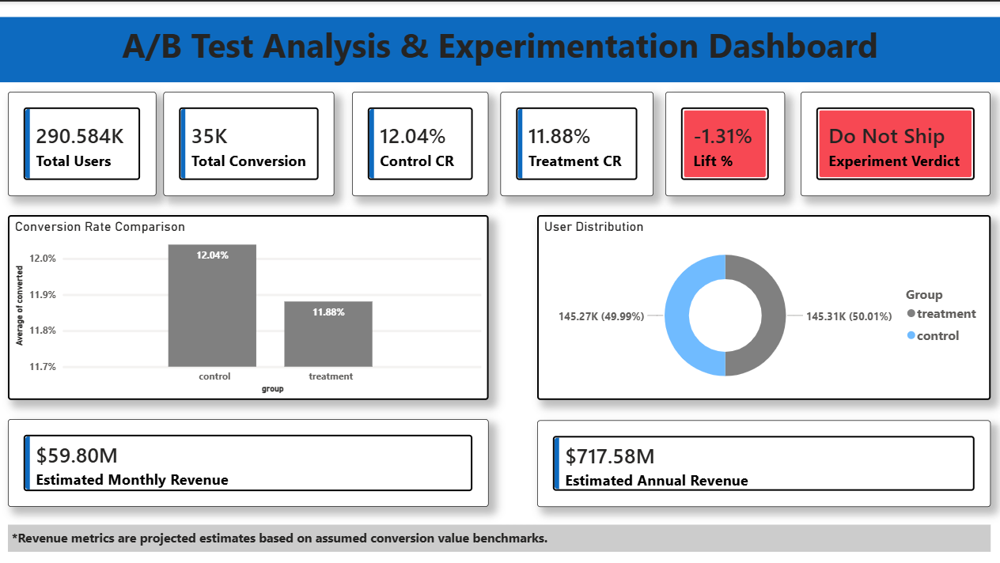
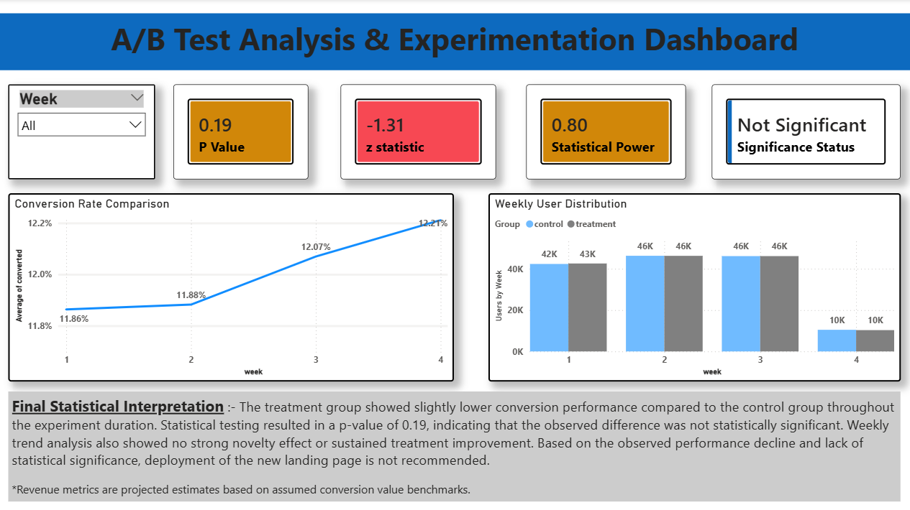

# 📊 Project 3 — A/B Test Analysis & Experimentation

**Landing Page Optimization | Conversion Rate Analysis | Statistical Testing | Business Impact**

---

## 🗂️ Project Overview

This project performs a complete end-to-end A/B test analysis to determine whether a **new landing page design** improves user conversion rates compared to the existing landing page.

The analysis covers data cleaning, statistical hypothesis testing, confidence interval estimation, power analysis, weekly trend analysis, business revenue impact estimation, SQL-based KPI queries, and an interactive Power BI dashboard.

**Final Verdict: Do Not Ship** — The new landing page showed no statistically significant improvement and underperformed the control page.

---

## 📌 Dashboard Preview

### Page 1 — Main KPI Dashboard

> 📸 *Insert screenshot of Page 1 of Power BI Dashboard here*



---

### Page 2 — Statistical Analysis & Weekly Trends

> 📸 *Insert screenshot of Page 2 of Power BI Dashboard here*



---

## 📁 Project Structure

```
project_3/
│
├── ab_data.csv                  # Raw dataset (294,478 rows)
├── ab_cleaned.csv               # Cleaned dataset (290,584 rows)
├── Project_3.ipynb              # Python notebook — full analysis
├── project_3.sql                # MySQL queries (15 queries)
├── Project_3_Dashboard.pbix     # Power BI dashboard file
└── README.md                    # Project documentation
```

---

## 📦 Dataset Description

| Column | Description |
|--------|-------------|
| `user_id` | Unique identifier for each user |
| `timestamp` | Date and time of user visit |
| `group` | Experiment group — `control` or `treatment` |
| `landing_page` | Page shown — `old_page` or `new_page` |
| `converted` | Outcome — `1` (converted) or `0` (not converted) |

---

## 🧹 Data Cleaning Steps

1. Loaded raw dataset — **294,478 rows**
2. Identified and removed **mismatched rows** where group and landing page did not align
   - Example: control user shown new_page, treatment user shown old_page
3. Found **1 duplicate user_id** (773192) and removed it
4. Final cleaned dataset — **290,584 unique users**
5. Exported cleaned data to `ab_cleaned.csv`
6. Pushed to MySQL database (`ab_testing_db`) for SQL analysis

---

## 📊 Experiment Results

| Metric | Value |
|--------|-------|
| Total Users | 290,584 |
| Control Group | 145,274 users (49.99%) |
| Treatment Group | 145,310 users (50.01%) |
| Control Conversion Rate | **12.04%** |
| Treatment Conversion Rate | **11.88%** |
| Absolute Difference | -0.16% |
| Relative Lift | **-1.31%** |

---

## 🔬 Statistical Testing

### Sample Ratio Mismatch (SRM) Check

A **Chi-Square test** was performed to verify the user split was balanced.

- Expected split: 50/50
- Actual split: 49.99% / 50.01%
- **Result: No SRM detected — randomization was valid**

---

### Two-Proportion Z-Test

| Metric | Value |
|--------|-------|
| Z-Statistic | -1.31 |
| P-Value | **0.19** |
| Significance Threshold (α) | 0.05 |
| Result | **NOT Statistically Significant** |

Since **p-value (0.19) > 0.05**, we **fail to reject the null hypothesis**.
The observed difference in conversion rates is due to random variation, not the landing page change.

---

### 95% Confidence Intervals

| Group | Conversion Rate | 95% CI |
|-------|-----------------|--------|
| Control | 12.04% | (11.87% , 12.21%) |
| Treatment | 11.88% | (11.71% , 12.05%) |

The confidence intervals **overlap substantially**, confirming no meaningful difference between the two pages.

---

### Statistical Power

| Parameter | Value |
|-----------|-------|
| Baseline CR | 12.04% |
| Target MDE | 2% relative lift |
| Sample Size (per group) | ~145,274 |
| Statistical Power | **0.80 (80%)** |

The experiment had 80% power to detect a 2% relative improvement — adequate sensitivity. However, the treatment page actually declined, making power a non-issue for the final decision.

---

## 📅 Weekly Trend Analysis

> 📸 *Insert screenshot of Weekly Conversion Rate Trend chart here*


| Week | Control CR | Treatment CR | Observation |
|------|-----------|--------------|-------------|
| Week 1 | 11.86% | 11.86% | Nearly identical at start |
| Week 2 | 11.88% | 11.88% | No difference observed |
| Week 3 | 12.07% | 12.07% | Both groups rise slightly |
| Week 4 | 12.21% | 12.21% | Partial week (~10K users each) |

- **No novelty effect detected** — treatment did not spike early and decline
- Both groups showed near-identical weekly trends throughout
- Week 4 reduced users (~10K vs ~46K) is due to partial data collection, confirmed by symmetric drop across both groups

---

## 💰 Business Impact

> ⚠️ Revenue figures are projected estimates using an assumed **$500 per conversion** benchmark. Not actual financial data.

| Metric | Control | Treatment |
|--------|---------|-----------|
| Assumed Monthly Users | 1,000,000 | 1,000,000 |
| Projected Monthly Conversions | 120,386 | 118,808 |
| Estimated Monthly Revenue | $60.19M | $59.40M |
| **Monthly Revenue Difference** | — | **-$789,000** |
| **Annual Revenue Difference** | — | **-$9.47M** |

**Deploying the new landing page could result in an estimated annual revenue loss of ~$9.47M.**

---

## 🛢️ SQL Analysis

15 structured queries were written in MySQL covering:

| # | Query Purpose |
|---|---------------|
| 1–3 | Data exploration — preview, row count, unique groups |
| 4 | Duplicate user check in SQL |
| 5–6 | User and conversion counts per group |
| 7 | Conversion rate per group |
| 8 | Relative conversion lift calculation |
| 9–11 | Weekly conversion trends — per group and side-by-side |
| 12–13 | Monthly conversion and revenue estimates |
| 14 | Master KPI summary query |
| 15 | Clean export dataset for Power BI |

---

## 📋 Assumptions

| Assumption | Reason |
|------------|--------|
| `converted = 1` represents a completed desired user action | Dataset provided only binary values (0/1). Value 1 was interpreted as a successful conversion event such as a purchase, sign-up, or form submission. |
| Users were randomly and independently assigned to groups | Random assignment eliminates selection bias. Independence satisfies the assumptions required by the two-proportion z-test. |
| $500 fixed revenue per conversion was assumed | No actual transaction data was available. A constant was applied uniformly to both groups for directional business impact estimation only. |
| All revenue metrics are projected estimates | Revenue is derived from the assumed benchmark, not real financial records. Figures illustrate potential impact under stated conditions. |
| Experiment environment remained stable throughout | Valid A/B testing assumes no major tracking failures, deployment bugs, or instrumentation errors during the test period. |
| Week 4 drop in users is due to partial data collection, not a system failure | The symmetric drop across both groups (control and treatment equally) confirms data collection ended mid-week rather than a biased event. |
| External factors did not significantly influence outcomes | Isolates the effect of the landing page change from unrelated variables such as campaigns, seasonal events, or abnormal traffic. |
| Significance threshold (α) = 0.05 | The 5% level is the widely accepted industry standard in A/B experimentation. p > 0.05 means we fail to reject the null hypothesis. |
| Sample ratio was acceptable (49.99% vs 50.01%) | Near-perfect 50/50 split confirmed via Chi-Square test. No sample ratio mismatch detected — randomization was valid. |
| Weekly aggregation was sufficient for trend analysis | With ~42K–46K users per group per week, weekly granularity provides statistically stable data points without daily noise. |
| Conclusions are based on conversion rate and statistical significance only | Scope is analytical. Broader factors like implementation cost, UX quality, and long-term retention were outside the dataset. |

---

## 🛠️ Tools Used

| Tool | Purpose |
|------|---------|
| Python (Pandas, NumPy) | Data loading, cleaning, EDA |
| SciPy / Statsmodels | Z-test, Chi-Square, Confidence Intervals, Power Analysis |
| Matplotlib | Weekly trend visualization |
| MySQL (SQLAlchemy, PyMySQL) | Data export and SQL-based KPI analysis |
| Power BI | Interactive dashboard — KPIs, trends, user distribution, revenue |

---

## ✅ Final Conclusion

| Decision Factor | Result | Implication |
|----------------|--------|-------------|
| Conversion Rate Lift | -1.31% | Treatment performed worse |
| P-Value | 0.19 (> 0.05) | Not statistically significant |
| Z-Statistic | -1.31 | Negative — confirms underperformance |
| Confidence Intervals | Overlapping | No meaningful difference |
| Statistical Power | 0.80 | Adequate — not the limiting factor |
| Weekly Trend | No novelty effect | No improvement at any point |
| Revenue Impact | -$9.47M/year | Deploying = potential revenue loss |

### 🚫 Recommendation: Do Not Ship

The new landing page should **not be deployed**. The evidence — negative lift, non-significant p-value, overlapping confidence intervals, and consistent underperformance across all 4 weeks — collectively confirms the treatment page offers no benefit over the control.

The product/design team should revisit the concept with fresh user research and test a fundamentally different variant before running another experiment.

---

*\* Revenue metrics are projected estimates based on assumed conversion value benchmarks ($500 per conversion). Actual revenue impact requires validation with real transaction data.*
